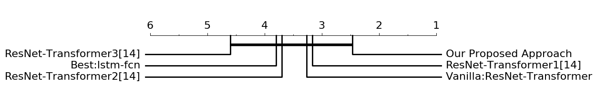

# TSCaps : Time Series Capsules
In this repo, we introduce it from four parts : first to introduce the dataset and how to download dataset, second to discuss the environments you need, third to disscuss the sturcture of this paper and how to train, and finally to introduce our experiments.
## Dataset
In our experiments, we use the UCR time series achive to evaluate our model, which it includes 128 vary datasets and its details are shown at http://www.timeseriesclassification.com . 
Here you can download dataset from the official websites or [my baidu Cloud](https://pan.baidu.com/s/1OY-G7YBD4osHrfg6PaIczA), which its key is 8u8u.
There is a sample picture in the standard dataset:<p align="center"></p> 
## Environments
The codes of this repo are tested on Python 3.6 and Tensorflow 1.13. First you must install some API your computers need. You can do as follows.
```
        pip3 install --user -r irequest.txt or sudo pip3 install -r request.txt
        python2: you can change pip3 into pip .
```
## Archetecture
First we introduce the structure of our codes:
```
---------

```
Second we discuss our proposed approach architectures:
### Overall proposed Structured
Our Proposed Approach includes four parts, which its details are shown as follows :<p align="center"></p> 
#### ReBuilding 
Use our decode layer to rebuild original features. There are some samples in the ECG5000 dataset of UCR Time Series Achive.<p align="center"></p> 
## Experiments
In this paper, we chose 43 datasets from the UCR time series achives. <p align="center"></p> 
There are some pre-trained model in my [my baidu Cloud]()
```
      Examples dir: there are some detailed training files. You can Download the keypointModel and add its path into the  respectively file. The results are same of above picture.
```


### How to Get Best Performance
```
        As the some datasets in the UCR are very  fragile, we therefore use the lr = 0.0001 to learn initially. When we find some local minimum of the training model, we must choose the lr*0.1. 
        When we do as above methods, we therefore need much more time to train and more training epoch.
```
### Caprisons
Compared with other existing algorithms, you can <p align="center"></p> 
<p align="center"></p> 

```  
         The Draw.py files can draw above two pictures. Thanks for  supporting this tool. 
```

## Citation
Now Under View in the IEEE Transaction on nerual networks and learning systems.
```
@article{IEEE Transaction on nerual networks and learning systems,   
  title={TSCaps:A Novel Multi-Capsule Neural Architecture for Time Series Classification},   
  author={Zhiwen Xiao, Xin Xu, Haoxi Zhang, Edward Szczerbicki, and Huanlai Xing, Member, IEEE},    
  journal={Uner View atIEEE Transaction on nerual networks and learning systems},    
  year={2020}    
}   
```
